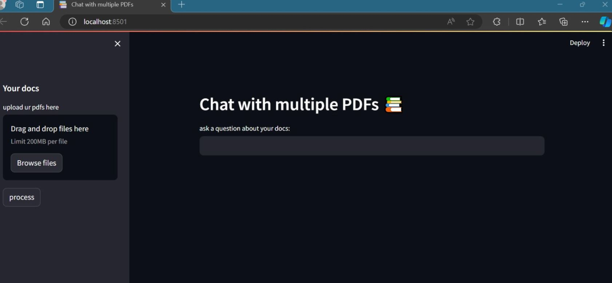

# Chat App with mutiple pdfs

Welcome to the PDF Question Answering System version 2 repository! This Python application allows you to chat with multiple PDF documents. You can ask questions about the PDFs using natural language, and the application will provide relevant responses based on the content of the documents. This app utilizes a language model to generate accurate answers to your queries. this version Utilizes LangChain's functionalities such as memory and retrieval augmented generation (RAG) to boost the application's performance and reliability.




## Features
- **PDF Parsing**: Extract text from PDF files using PyPDF2.
- **Text Chunking**: Split large texts into manageable chunks using RecursiveCharacterTextSplitter.
- **Embeddings and Vector Search**: Create embeddings of text chunks with OpenAIEmbeddings and perform efficient similarity searches with FAISS.
- **Question Answering**: Use LangChain's question-answering capabilities to provide precise and contextually accurate answers.
- **Conversational Interface**: Interactive user interface built with Streamlit for seamless user experience.


## Implementation Details

- **Selected LLM**: Utilized GPT-3 based on the application's requirements for generating accurate and context-aware responses.
- **Prompt Design**: Designed effective prompts to elicit the desired responses from GPT-3.
- **LangChain Functionalities**:
  - **Memory**: Maintained conversation history to provide context for ongoing interactions.
  - **Retrieval Augmented Generation (RAG)**: Enhanced the application's performance by integrating retrieval mechanisms to fetch relevant document chunks.
- **User-Friendly Interface**: Developed an intuitive interface using Streamlit to ensure seamless user interaction.


## Installation

To run this project locally, follow these steps:

1. **Clone the repository**:
    ```bash
    git clone https://github.com/yourusername/pdf-question-answering-system.git
    cd pdf-question-answering-system
    ```

2. **Install dependencies**:
    ```bash
    pip install -r requirements.txt
    ```

3. **Set up environment variables**:
    Create a `.env` file in the root directory and add your OpenAI API key:
    ```
    OPENAI_API_KEY=your_openai_api_key
    ```

4. **Run the application**:
    ```bash
    streamlit run chatbot.py
    ```
